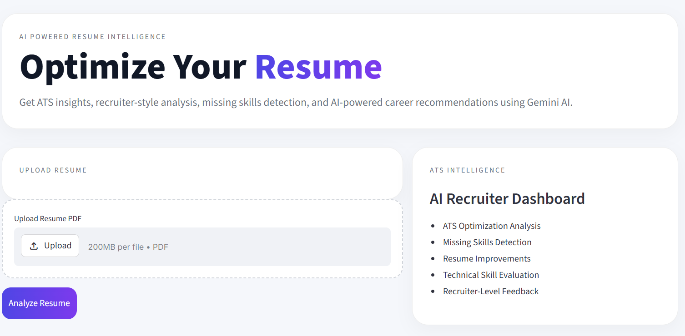
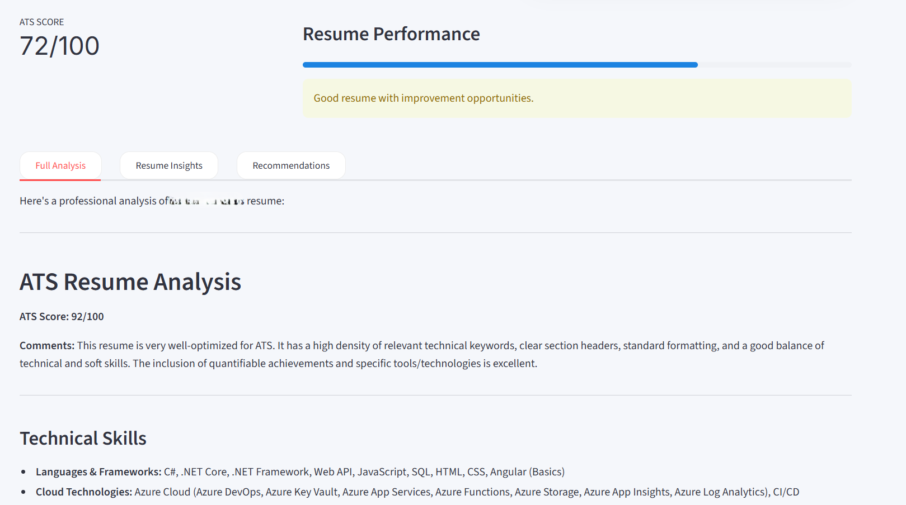
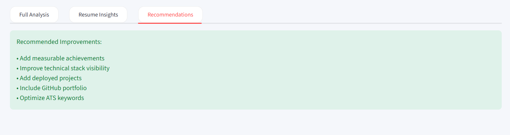

# 🚀 AI Resume Analyzer

An AI-powered ATS Resume Analyzer built using Streamlit and Gemini AI.

---

## 🔥 Features

- ATS Resume Score
- Resume Strength Analysis
- Missing Skills Detection
- Resume Improvement Suggestions
- AI-Powered Professional Summary
- Best Job Role Recommendations

---

## 🛠 Tech Stack

- Python
- Streamlit
- Gemini AI
- PyPDF2
- NLP

---

## 📸 Screenshots

### Hero Section



---

### Resume Analysis Output



---

### Recommendations Panel



---

## ⚡ Installation

```bash
pip install -r requirements.txt
```

Run project:

```bash
python -m streamlit run app.py
```

---

## 👨‍💻 Developer

Aakif Makrani

- LinkedIn:
https://www.linkedin.com/in/aakif-makrani-6634a9230/

- GitHub:
https://github.com/aakifmakrani
